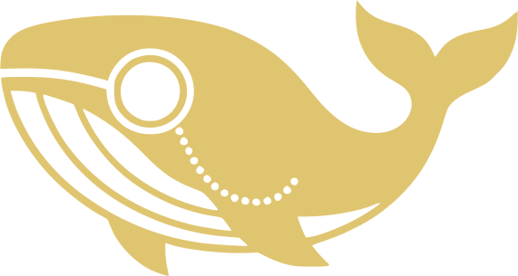
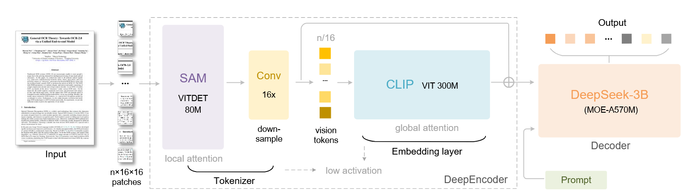

<!-- Ancre vers le haut -->

<a id="readme-top"></a>

[![Contributors][contributors-shield]][contributors-url]
[![Forks][forks-shield]][forks-url]
[![Stargazers][stars-shield]][stars-url]
[![Issues][issues-shield]][issues-url]
[![project_license][license-shield]][license-url]
[![LinkedIn][linkedin-shield]][linkedin-url]

<br />
<div align="center">
  <a href="https://github.com/alfred0404/lightseek-ocr">
    
  </a>

  <h3 align="center">LightSeek-OCR</h3>

  <p align="center">
    Implémentation légère et exploration de l'architecture de DeepSeek-OCR.
    <br />
    <a href="https://github.com/alfred0404/lightseek-ocr"><strong>Parcourir le repo »</strong></a>
  </p>
</div>

## À propos du projet

LightSeek-OCR est une ré-implémentation légère et expérimentale inspirée par DeepSeek-OCR : convertir du texte en représentations visuelles afin d'étendre la fenêtre de contexte effective des modèles de langage.

Le but de ce dépôt est de fournir une implémentation simple et lisible pour permettre aux chercheurs et développeurs d'expérimenter et d'évaluer si la compression texte->image peut réduire le nombre de tokens tout en conservant l'information.

<p align="center">
    
    <em>Fig 1. DeepSeek-OCR Architecture</em>
</p>

## Démarrage

Prérequis

- Python 3.8+
- pip

Installer les dépendances :

```bash
pip install -r requirements.txt
```

Cloner le dépôt :

```bash
git clone https://github.com/alfred0404/lightseek-ocr.git
cd lightseek-ocr
```

## Utilisation

- Consultez le dossier `examples/` pour des scripts de démo (texte -> image -> évaluation).
- Flux de travail typique :
  1. Préparer un corpus de texte.
  2. Rendre des sections de texte en images.
  3. Exécuter l'OCR/encodeur et évaluer la performance.

## Contribuer

Les contributions sont bienvenues : signalez des bugs via des issues et proposez des pull requests pour les améliorations.

<p align="center"><a href="#readme-top">back to top</a></p>

## Licence

Distribué sous la licence du projet. Voir `LICENSE.txt` pour les détails.

<p align="center"><a href="#readme-top">back to top</a></p>

<!-- MARKDOWN LINKS & IMAGES -->
[contributors-shield]: https://img.shields.io/github/contributors/alfred0404/lightseek-ocr.svg?style=for-the-badge
[contributors-url]: https://github.com/alfred0404/lightseek-ocr/graphs/contributors
[forks-shield]: https://img.shields.io/github/forks/alfred0404/lightseek-ocr.svg?style=for-the-badge
[forks-url]: https://github.com/alfred0404/lightseek-ocr/network/members
[stars-shield]: https://img.shields.io/github/stars/alfred0404/lightseek-ocr.svg?style=for-the-badge
[stars-url]: https://github.com/alfred0404/lightseek-ocr/stargazers
[issues-shield]: https://img.shields.io/github/issues/alfred0404/lightseek-ocr.svg?style=for-the-badge
[issues-url]: https://github.com/alfred0404/lightseek-ocr/issues
[license-shield]: https://img.shields.io/github/license/alfred0404/lightseek-ocr.svg?style=for-the-badge
[license-url]: https://github.com/alfred0404/lightseek-ocr/blob/master/LICENSE.txt
[linkedin-shield]: https://img.shields.io/badge/-LinkedIn-black.svg?style=for-the-badge&logo=linkedin&colorB=555
[linkedin-url]: https://linkedin.com/in/alfred-de-vulpian
[DeepSeek-OCR]: https://github.com/deepseek-ai/DeepSeek-OCR/tree/main
[product-screenshot]: images/screenshot.png
[Python]: https://img.shields.io/badge/python-000000?style=for-the-badge&logo=python&
[Python-url]: https://www.python.org/

<!-- Logo Colors -->
[deepseek-blue]: #4d6bfe
[deepseek-blue-complementary]: #E0C570

<!-- Images -->
[DeepSeek-OCR_Architecture_path]: images/DeepSeek-OCR_Architecture.png